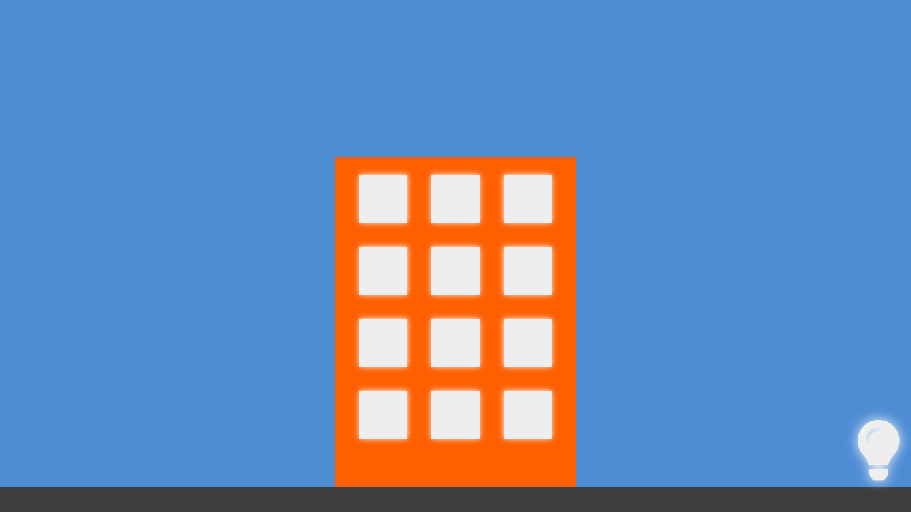
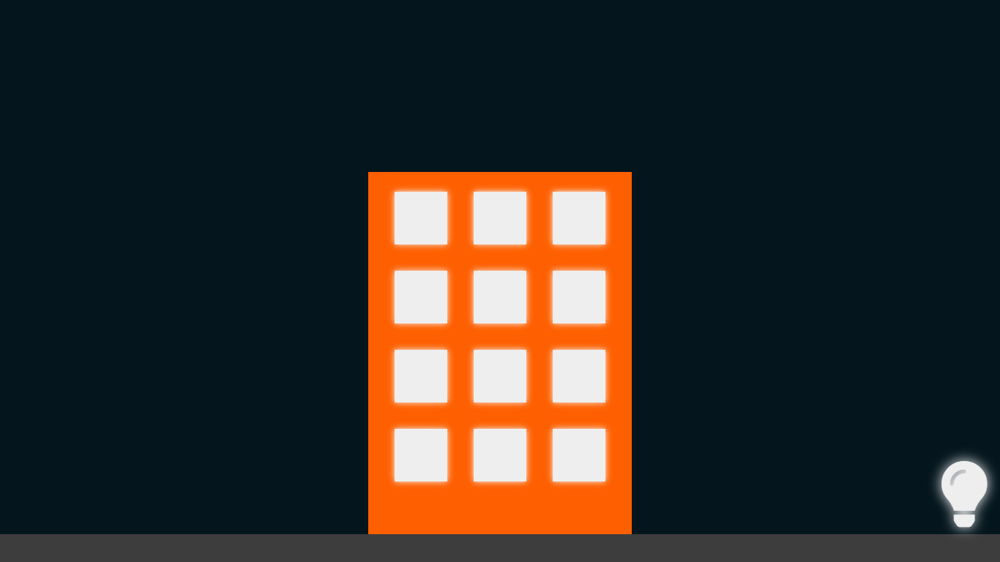
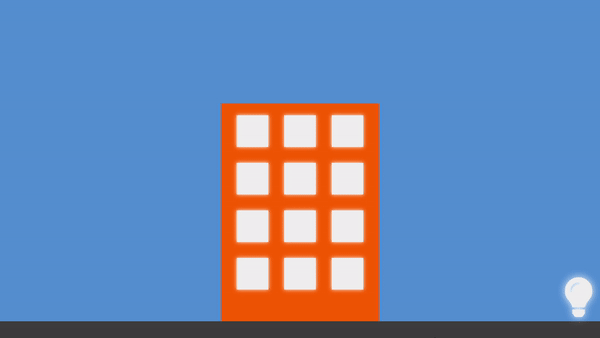

# aftersale TECH Trainee Challenge v2

Projeto desenvolvido para processo seletivo do programa trainee da aftesale.

O projeto consiste em um pequeno cenário contendo um prédio com 12 janelas. Ao clicar nas janelas as luzes ligam e desligam. Também há um botão onde todas as luzes são acesas ou apagadas.

## Tecnologias :hammer_and_wrench:

O projeto foi desenvolvido com ReactJS, Typescript e styled-components

Fiz uso da Sunset Sunrise API junto com a API do browser de geolocalização para identificar se é dia ou noite no local do usuário e então alterar o o background da cena.


## Demonstração :art:

Cenário dia:




Cenário noite




Demonstração animada:




## Para executar o projeto :computer:

Para executar o projeto:

- Clone este repositório

  ```
  git clone https://github.com/davi-santos5/aftersale-tech-challenge-v2.git
  ```


- Instale as dependências

  ```
  yarn
  ```

  ou

  ```
  npm i
  ```


- Execute o projeto

  ```
  yarn start
  ```

  ou

  ```
  npm run start
  ```

  